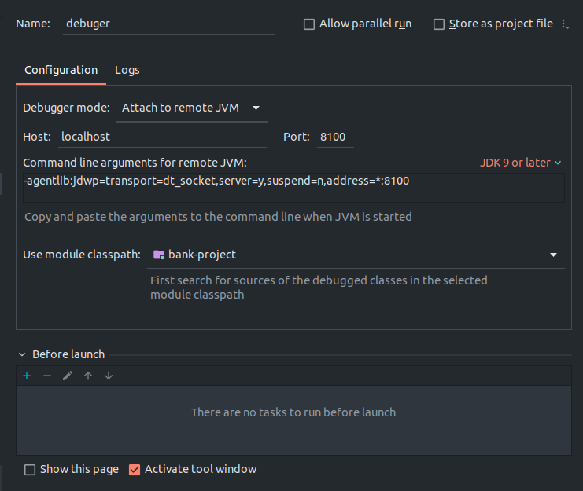
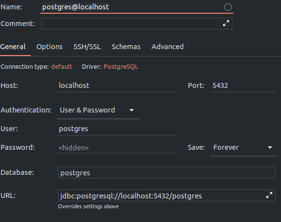

# EPM-LSTR-VENUS Bank project

**System requirements:**
1. Java 11
2. docker 19.03.0+
3. docker-compose 1.26.0+

**To launch the app follow the next steps:**
1. `git clone {url}`
2. `cd bank-project`
3. `./gradlew build --refresh-dependencies` (or you can use gradle toolbar of IDEA)
4. `docker-compose -f docker/docker-compose.yaml up -d --force-recreate`
5. in your browser check the link http://localhost:8080/atm/test. You will see the welcome page.

**To debug the app you need set up debug preferences:**
1. choose "Edit configurations..." in configuration toolbar
2. choose "Add new configuration" (plus icon)
3. choose "Remote JVM Debug"
4. set up configuration according to the picture

5. choose the debug configuration in select and press "debug" (on the right side from select)
6. since now, you can set a breakpoint and debug the app (for example, set a breakpoint in AuthServlet and check the link with welcome message).

**To use db through IDEA follow the next steps:**
1. open database toolbar
2. add new postgresql datasource (plus icon)
3. set up configuration according to the picture (don't forget to enter the password, the default one is shown in docker-compose.yaml file)

4. since now, you can check db condition.